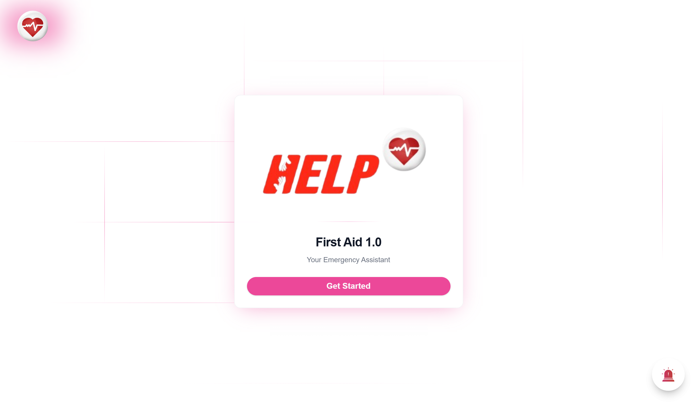
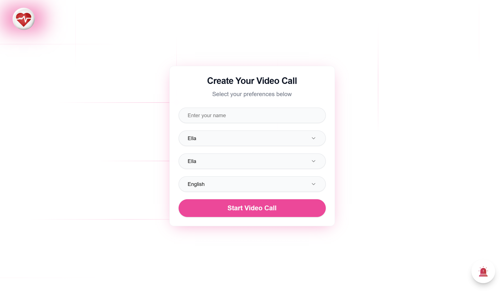
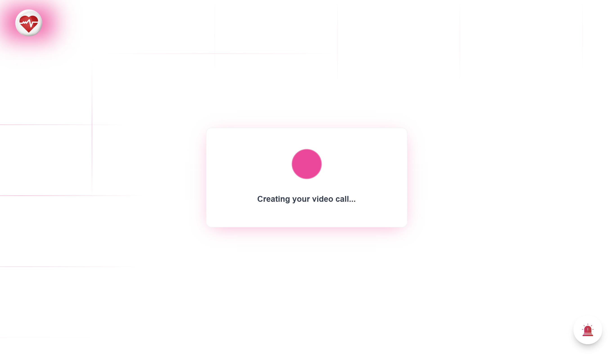

# HELP – AI-Powered First Aid Web App

HELP is a voice-enabled, AI-powered progressive web application that guides users through first aid procedures step by step.  
It is designed to reduce panic and confusion during emergencies by providing a calm, conversational assistant named **Ella** and **Kay**.

## 🎯 Purpose

In emergency situations, panic and confusion can be life-threatening. HELP addresses this critical need by providing:
- **Immediate guidance** for common medical emergencies
- **Step-by-step instructions** delivered through AI avatars
- **Voice interaction** to keep hands free during emergencies
- **Multi-language support** for diverse communities
- **Emergency contact integration** with local emergency services

---

## 🚀 Features

### Core Functionality
- **Conversational AI Experience**: Powered by Tavus and OpenAI for natural interaction
- **Dual AI Avatars**: Choose between Ella and Kay for personalized assistance
- **Voice-Guided Instructions**: Step-by-step first aid for 10+ common emergencies
- **Multi-Language Support**: Available in English, Spanish, French, German, Italian, Portuguese, Japanese, Korean, Mandarin, and Hindi
- **Emergency Services Integration**: One-touch calling for Police (191), Fire (192), and Ambulance (193)

### Technical Features
- **Progressive Web App (PWA)**: Offline access and app-like experience
- **Real-time Video Calls**: HD video interaction with AI avatars
- **Responsive Design**: Mobile-first approach for accessibility during emergencies
- **User Confirmation System**: Ensures each step is completed before proceeding
- **Animated UI**: Smooth transitions and intuitive interface

### Emergency Services
- **🚑 Ambulance (193)**: Medical emergencies and health crises
- **🔥 Fire Service (192)**: Fire emergencies and rescue situations  
- **👮 Police (191)**: Security emergencies and crime reporting

---

## 🛠️ Built With

### Frontend
- **React.js** – Modern component-based UI framework
- **Next.js** – Full-stack React framework with SSR
- **TypeScript** – Type-safe development
- **Tailwind CSS** – Utility-first CSS framework
- **Framer Motion** – Animation library for smooth transitions

### AI & Communication
- **Tavus API** – AI persona video generation and real-time interaction
- **OpenAI LLM** – Conversational AI and emergency response logic
- **Axios** – HTTP client for API communication

### Development Tools
- **ESLint** – Code linting and quality assurance
- **PostCSS** – CSS processing and optimization
- **Shadcn/ui** – Modern component library

---

## 🏗️ Project Structure

```
your-app-name/
├── app/                    # Next.js app directory
│   ├── api/               # API routes
│   │   └── tavus/         # Tavus integration
│   ├── layout.tsx         # Root layout
│   └── page.tsx           # Main application
├── components/            # Reusable UI components
│   └── ui/               # Base UI components
├── lib/                  # Utility functions
├── public/               # Static assets
│   ├── 1.png             # Welcome screen screenshot
│   ├── 2.png             # Avatar selection screenshot
│   ├── 3.png             # Video call interface screenshot
│   ├── amb.png           # Ambulance icon
│   ├── fire.png          # Fire service icon
│   ├── police.webp       # Police icon
│   └── Emerg.png         # Emergency services icon
└── Configuration files
```

---

## 📸 Visuals

Below are sample screenshots of the HELP application:

  
 
 
  


---

## 🚨 Emergency Numbers

This application is configured for emergency services with the following numbers:
- **Police**: 191
- **Fire Service**: 192  
- **Ambulance**: 193

*Note: Emergency numbers may vary by country. Please verify local emergency numbers for your region.*

---

## 📦 Installation & Setup

### Prerequisites
- Node.js (v18 or higher)
- npm or yarn package manager
- Tavus API key
- Modern web browser with camera/microphone support

### Local Development

```bash
# 1. Clone the repository
git clone https://github.com/samuelKobby/HELP.git

# 2. Navigate into the project folder
cd your-app-name

# 3. Install dependencies
npm install

# 4. Set up environment variables
cp .env.example .env.local
# Edit .env.local with your Tavus API key

# 5. Start the development server
npm run dev

# 6. Open your browser
# Navigate to http://localhost:3000
```

### Environment Variables

Create a `.env.local` file in the root directory:

```env
TAVUS_API_KEY=your_tavus_api_key_here
NEXT_PUBLIC_APP_URL=http://localhost:3000
```

### Build for Production

```bash
# Build the application
npm run build

# Start production server
npm run start
```

---

## 🎮 Usage Guide

### Getting Started
1. **Launch the App**: Open HELP in your web browser
2. **Enter Your Name**: Provide your name for personalized interaction
3. **Select Avatar**: Choose between Ella or Kay
4. **Choose Language**: Select your preferred language from 10 available options
5. **Start Video Call**: Begin your emergency assistance session

### During an Emergency
1. **Stay Calm**: The AI avatar will guide you through each step
2. **Follow Instructions**: Listen carefully and confirm each completed step
3. **Use Emergency Buttons**: Access quick-dial emergency services if needed
4. **Ask Questions**: The AI can clarify instructions and provide additional help

### Emergency Features
- **Floating Emergency Panel**: Always visible emergency service buttons
- **One-Touch Calling**: Direct access to emergency services
- **Multi-Language Support**: Critical for diverse communities
- **Offline Capability**: Core functionality works without internet

---

## 📋 Roadmap

### Version 2.0 Features
- [ ] Advanced medical procedures and guidance
- [ ] Integration with local emergency services
- [ ] Offline voice recognition
- [ ] Medical history integration
- [ ] Family emergency contacts
- [ ] GPS location sharing with emergency services

### Future Enhancements
- [ ] AR-guided first aid instructions
- [ ] Integration with wearable devices
- [ ] Professional medical consultation
- [ ] Community first aid reporting
- [ ] Advanced analytics and insights

---

## 📄 License

This project is licensed under the MIT License - see the [LICENSE](LICENSE) file for details.

---

## 🆘 Support

If you need help or have questions:

- **Documentation**: Check this README and inline code comments
- **Issues**: Open a GitHub issue for bugs or feature requests
- **Emergency**: This app is for guidance only - always call professional emergency services for serious situations

---

## ⚠️ Disclaimer

**IMPORTANT**: This application provides general first aid guidance and should not replace professional medical advice, diagnosis, or treatment. In serious emergencies, always contact professional emergency services immediately. The developers are not responsible for any outcomes resulting from the use of this application.

---

## 🙏 Acknowledgments

- **Tavus** for providing advanced AI avatar technology
- **OpenAI** for conversational AI capabilities
- **Emergency Services** worldwide for their life-saving work
- **First Aid Organizations** for establishing emergency response protocols
- **Open Source Community** for tools and libraries that made this possible

---

**Built with ❤️ for emergency preparedness and community safety**
